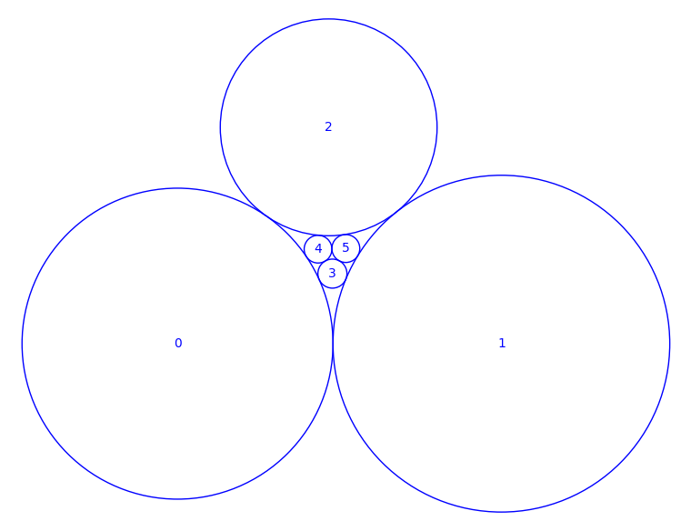

# Circle Packings

A class for circle packings that computes them numerically and studies some of their algebraic properties.

### Contents

 - *circle-packings.sage* - Source code

### Fun results

**Theorem.** _Consider a planar circle packing that is combinatorially equivalent to the graph of an octahedron or an icosahedron. Then the sum of the curvatures of any two opposite circles is the same, independent of the choice of the pair._

A similar result holds for double pyramids over n-gons. I have an elegant conceptual proof, but let me keep this readme at a minimum.

### Example code

sage: CirclePacking(graphs.OctahedralGraph()).show()

### Authors

Benjamin Matschke.

### License

Creative Commons BY-NC 4.0.
